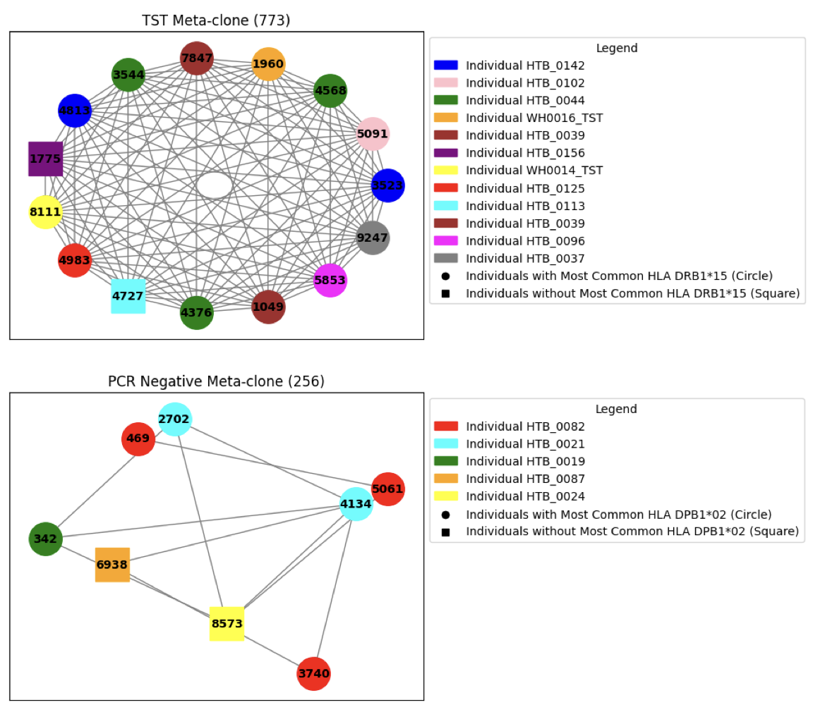

**HLA-enrichment of Clusters in Mtb-associated TCR sequence repertoires**

Meta-clones, a group of non-identical TCR sequences of similar biochemistry and shared antigen specificity, are key to harnessing TCR repertoires as public biomarkers; however, the process of generating meta-clone biomarkers still requires refinement.

My dissertation thesis used Python data wrangling methods to construct a HLA-restriction pipeline which would distinguish meta-clones from clusters of
TCR sequences lacking shared specificity.

Click [here](files/dissertation.pdf) to read my paper

  

# Let's build something better.

I strongly believe that public health has a responsibility to make sure that what we work towards does no harm and I try to be as ethical as I can in taking on projects.

If your organisation represents clinical trial fraud, or concealing data and monetises public health needs, then I am probably not the best fit for your project. All that said, if you are looking for help building something that promotes sustainability, collaboration, or generally aims to make a positive impact for all, then let’s talk.

<a href="mailto:fp2513@cumc.columbia.edu" class="btn btn-primary" style="font-size: 1.2em; padding: 10px 20px; color: white; text-decoration: none;">
  Get in Touch
</a>
